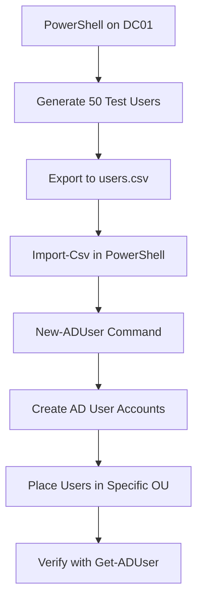
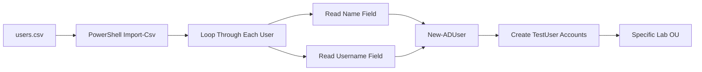
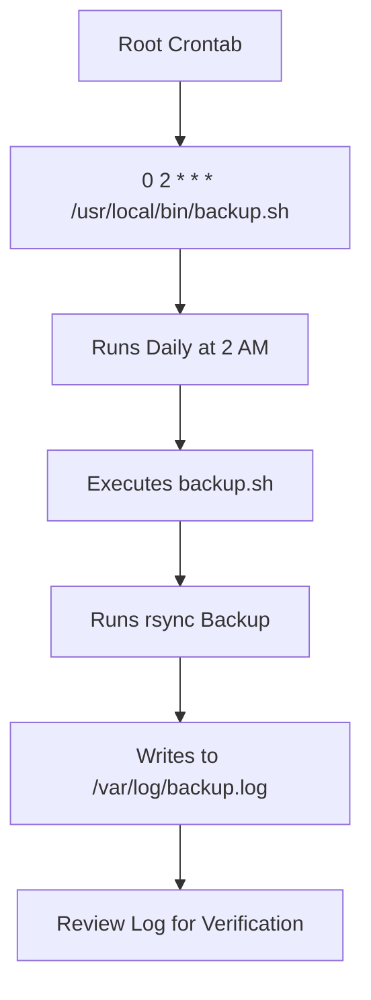
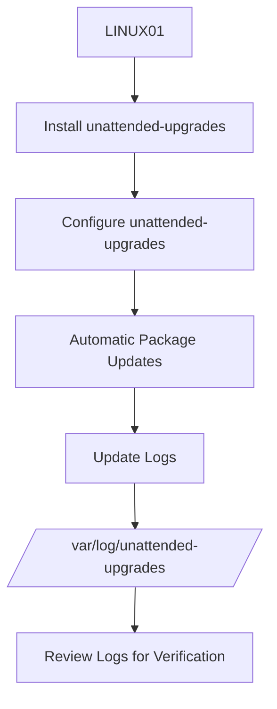
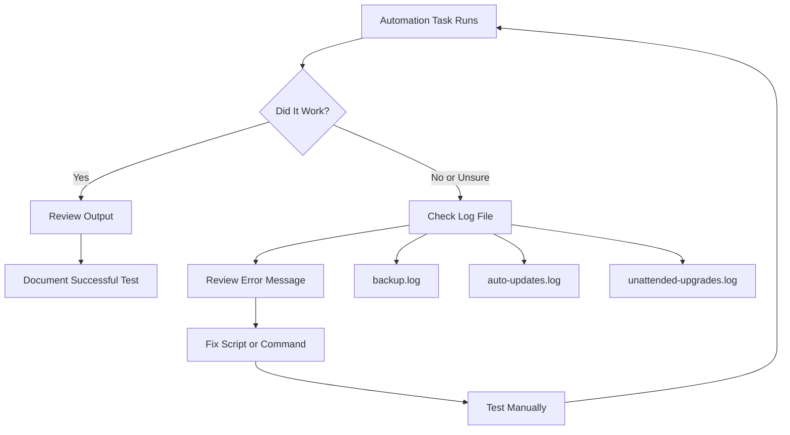
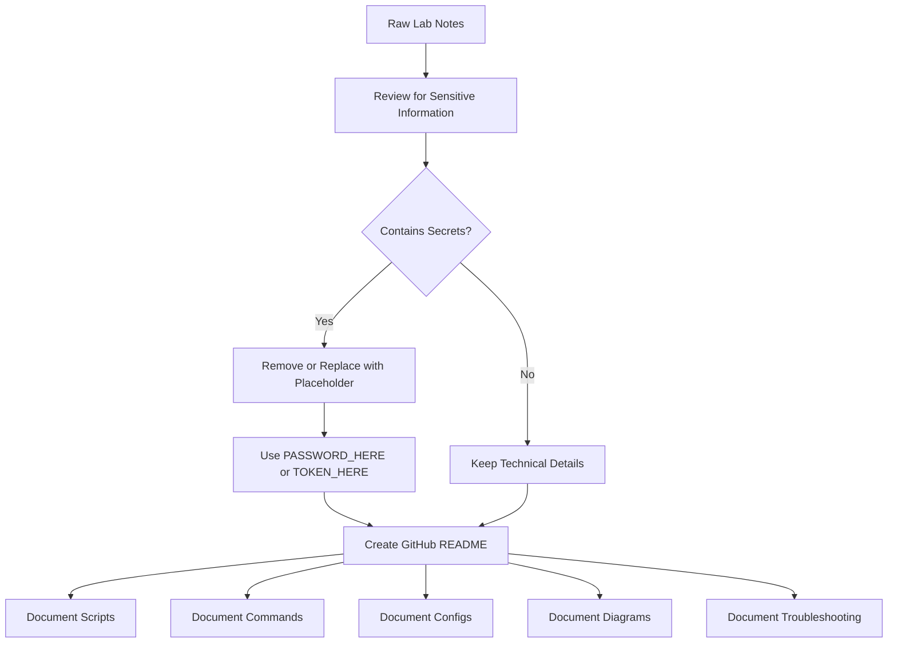
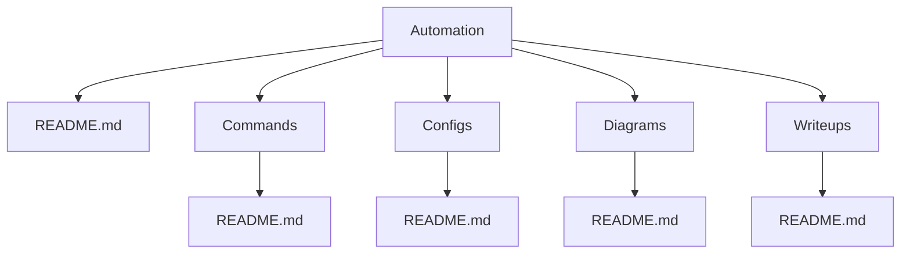

# Automation Diagrams

## Overview

This file contains diagrams for the Automation Lab in my SysAdmin Home Lab project.

The diagrams show how automation was used across Windows and Linux systems, including:

- PowerShell automation on DC01
- CSV-based Active Directory user creation
- Bash scripting on LINUX01
- rsync backup automation
- cron scheduling examples
- Linux automatic updates with `unattended-upgrades`
- Logging for troubleshooting and verification

This was completed in a home lab environment for Junior System Administrator practice.

---

## Diagram 1: Automation Lab Overview

```mermaid
flowchart TD
    A[Automation Lab] --> B[Windows Automation]
    A --> C[Linux Automation]

    B --> D[DC01]
    D --> E[PowerShell Scripts]
    E --> F[Generate users.csv]
    E --> G[Bulk Create AD Test Users]
    G --> H[Specific Lab OU]

    C --> I[LINUX01]
    I --> J[Bash Scripts]
    I --> K[Cron Examples]
    I --> L[unattended-upgrades]

    J --> M[backup.sh]
    M --> N[rsync Backup]
    N --> O[/mnt/media Source]
    N --> P[/backup/media Destination]
    N --> Q[/var/log/backup.log]

    K --> R[Update Cron Example]
    R --> S[/var/log/auto-updates.log]

    L --> T[Automatic Linux Updates]
    T --> U[/var/log/unattended-upgrades/]
```

### What This Diagram Shows

This diagram shows the main parts of the Automation Lab. Windows automation was completed on DC01 using PowerShell, while Linux automation was completed on LINUX01 using Bash, cron examples, rsync, and `unattended-upgrades`.

---

## Diagram 2: PowerShell Active Directory User Automation



### What This Diagram Shows

This diagram shows the PowerShell workflow used to create test users in Active Directory.

The process started by generating a CSV file, then importing that CSV file into PowerShell, and finally using `New-ADUser` to create the accounts.

---

## Diagram 3: CSV to Active Directory Workflow



### What This Diagram Shows

This diagram shows how the CSV file was used as the input source for bulk Active Directory user creation.

Each row in the CSV contained user information. PowerShell read each row and created the matching AD user account.

---

## Diagram 4: Linux Backup Automation Flow

```mermaid
flowchart TD
    A[LINUX01] --> B[backup.sh]
    B --> C[Define Source Directory]
    B --> D[Define Destination Directory]
    C --> E[/mnt/media]
    D --> F[/backup/media]
    E --> G[rsync -avh --delete]
    F --> G
    G --> H[Copy and Sync Files]
    H --> I[Write Output to Log]
    I --> J[/var/log/backup.log]
```

### What This Diagram Shows

This diagram shows the backup automation workflow on LINUX01.

The `backup.sh` script defined a source directory and destination directory, then used `rsync` to sync files and write output to a log file.

---

## Diagram 5: Cron Backup Scheduling Example



### What This Diagram Shows

This diagram shows how the backup script could be scheduled with cron.

The cron example runs the backup script every day at 2 AM and logs the results for later review.

---

## Diagram 6: Linux Update Automation Example

```mermaid
flowchart TD
    A[Root Crontab] --> B[0 3 * * * apt update && apt upgrade -y]
    B --> C[Runs Daily at 3 AM]
    C --> D[Updates Package Lists]
    D --> E[Upgrades Packages]
    E --> F[Logs Output and Errors]
    F --> G[/var/log/auto-updates.log]
    G --> H[Review Log for Troubleshooting]
```

### What This Diagram Shows

This diagram shows the Linux update cron example.

The cron job runs package updates and redirects normal output and errors to a log file so the results can be reviewed later.

---

## Diagram 7: unattended-upgrades Workflow



### What This Diagram Shows

This diagram shows the basic workflow for using `unattended-upgrades`.

Instead of only relying on a custom cron job for updates, `unattended-upgrades` provides a built-in Linux method for automatic updates.

---

## Diagram 8: Logging and Troubleshooting Flow



### What This Diagram Shows

This diagram shows the troubleshooting process used for automation tasks.

Since scheduled jobs can fail silently, logs are important for checking what happened, identifying errors, and confirming whether the automation worked.

---

## Diagram 9: GitHub-Safe Automation Documentation Flow



### What This Diagram Shows

This diagram shows how the raw lab notes were cleaned before being added to GitHub.

Passwords and sensitive values should be removed or replaced with placeholders before publishing documentation.

---

## Diagram 10: Automation Lab Folder Structure



### What This Diagram Shows

This diagram shows the recommended folder structure for the Automation project inside the SysAdmin-HomeLab GitHub repo.

Each folder documents a different part of the project.

---

## Suggested Screenshot-Based Diagrams to Add Later

| Diagram or Screenshot | What to Capture | Why It Matters | Suggested Filename |
|---|---|---|---|
| Automation overview | A simple diagram showing DC01 and LINUX01 automation tasks | Shows the full project scope | `automation-overview.png` |
| PowerShell CSV creation | PowerShell command creating `users.csv` | Shows user generation automation | `powershell-csv-generation.png` |
| Active Directory users | Test users created in the specific OU | Proves the AD automation worked | `ad-test-users-ou.png` |
| Backup script flow | `backup.sh` open in terminal or editor | Shows the Bash automation script | `backup-script-flow.png` |
| Cron examples | Root crontab showing automation examples | Shows scheduling practice | `cron-examples.png` |
| Backup log | `/var/log/backup.log` output | Shows backup verification | `backup-log-output.png` |
| unattended-upgrades | Configuration or status output | Shows automatic update configuration | `unattended-upgrades-status.png` |
| GitHub folder structure | Automation project folders in GitHub | Shows organized documentation | `automation-folder-structure.png` |

---

## Notes for GitHub Mermaid Diagrams

GitHub supports Mermaid diagrams inside markdown files. If a diagram does not render correctly:

1. Check that the code block starts with:

```text
```mermaid
```

2. Check that the code block ends with:

```text
```
```

3. Avoid using complicated symbols inside node names.
4. Avoid using unescaped parentheses or special characters if GitHub gives a rendering error.
5. Keep diagrams simple and readable.

---

## Lessons Learned

- Diagrams help explain automation workflows clearly.
- PowerShell automation can be shown as a CSV-to-AD workflow.
- Linux automation can be shown as script, scheduler, command, and log flow.
- Logs are an important part of automation diagrams because they show how tasks are verified.
- GitHub documentation should be sanitized before publishing.
- Mermaid diagrams are useful because they can be written directly in markdown.
