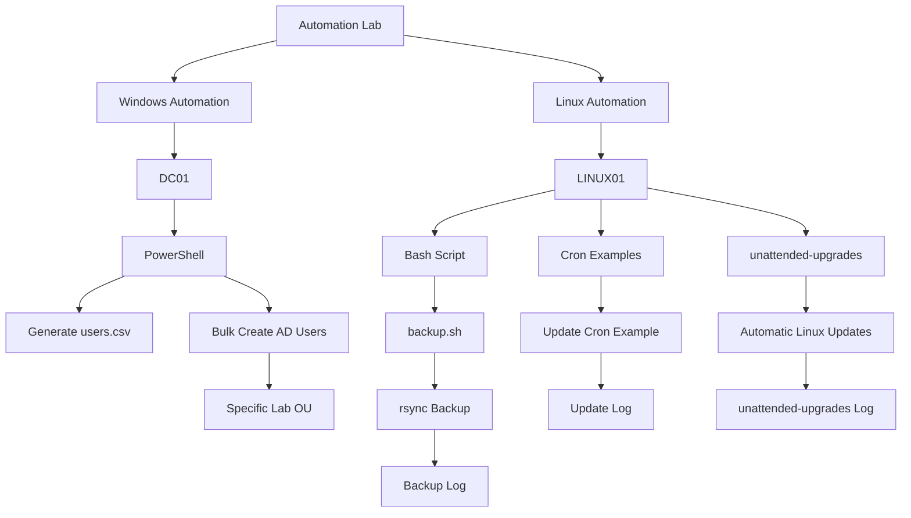
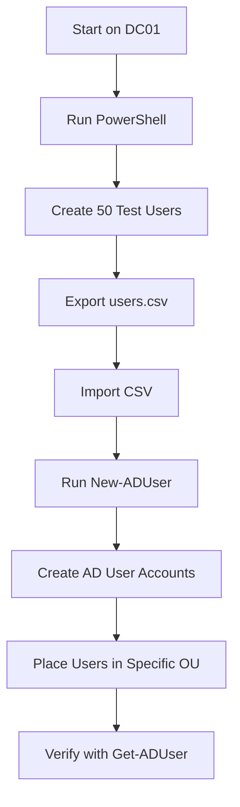
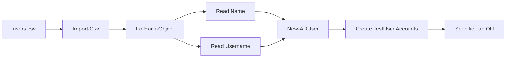
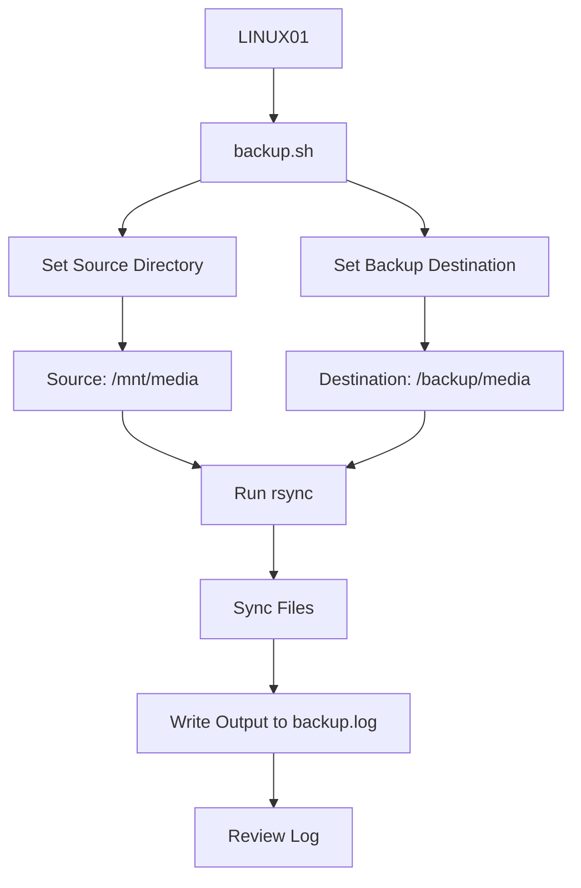
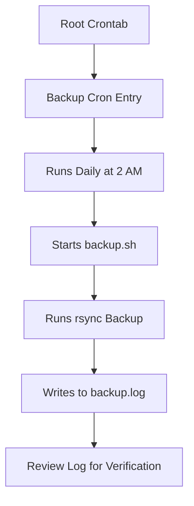
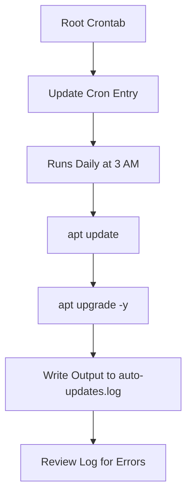
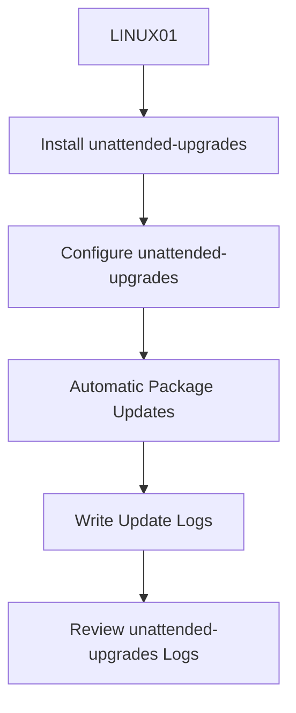
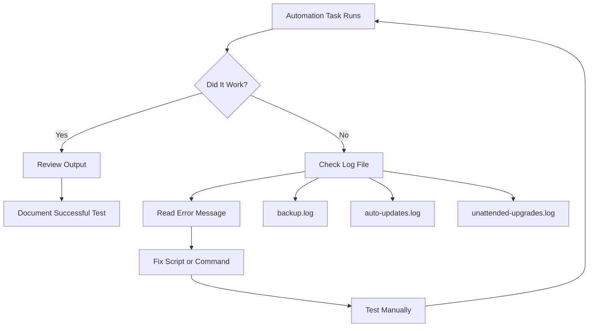
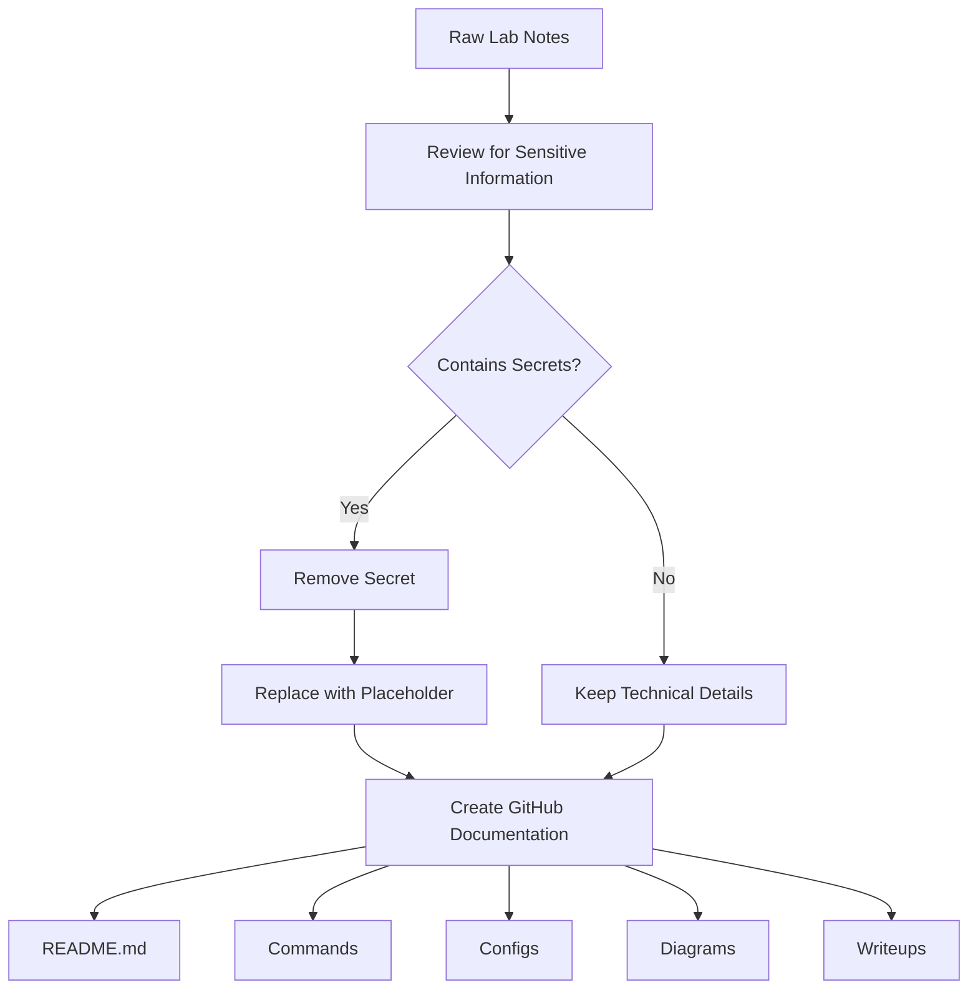
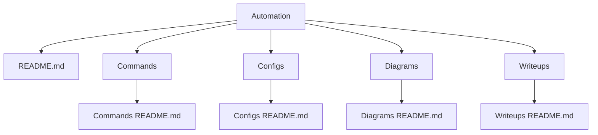

# Automation Diagrams

## Overview

This folder contains diagrams for the Automation Lab in my SysAdmin Home Lab project.

These diagrams explain how automation was used across Windows and Linux systems, including PowerShell automation, Active Directory bulk user creation, Bash scripting, rsync backups, cron examples, unattended-upgrades, and logging.

This was completed in a home lab environment for Junior System Administrator practice.

---

## Diagram 1: Automation Lab Overview



### Explanation

This diagram shows the overall Automation Lab. DC01 was used for PowerShell and Active Directory automation. LINUX01 was used for Bash scripting, rsync backup automation, cron examples, and unattended-upgrades.

---

## Diagram 2: PowerShell Active Directory Automation



### Explanation

This diagram shows the PowerShell workflow used to create test users in Active Directory.

The process started by generating a CSV file, importing it into PowerShell, and using `New-ADUser` to create the accounts.

---

## Diagram 3: CSV to Active Directory Workflow



### Explanation

This diagram shows how the CSV file was used as the input source for bulk Active Directory user creation.

Each row in the CSV contained user information. PowerShell read each row and created the matching AD user account.

---

## Diagram 4: Linux Backup Automation



### Explanation

This diagram shows the Linux backup automation workflow.

The `backup.sh` script defines a source and destination, runs `rsync`, copies files, and writes the output to a log file.

---

## Diagram 5: Backup Scheduling Example



### Explanation

This diagram shows how the backup script could be scheduled with cron.

The cron example runs the backup script every day at 2 AM and logs the results for later review.

---

## Diagram 6: Linux Update Cron Example



### Explanation

This diagram shows the Linux update cron example.

The cron job runs package updates and sends output and errors to a log file so the results can be reviewed later.

---

## Diagram 7: unattended-upgrades Workflow



### Explanation

This diagram shows the basic workflow for `unattended-upgrades`.

Instead of only relying on a custom cron job for updates, `unattended-upgrades` provides a built-in Linux method for automatic package updates.

---

## Diagram 8: Logging and Troubleshooting Flow



### Explanation

This diagram shows the troubleshooting process for automation tasks.

Logs are important because scheduled jobs can fail silently. Checking log files helps confirm whether the automation worked or failed.

---

## Diagram 9: GitHub-Safe Documentation Flow



### Explanation

This diagram shows how the raw lab notes were cleaned before being added to GitHub.

Passwords and sensitive values should be removed or replaced with placeholders before publishing documentation.

---

## Diagram 10: Automation Folder Structure



### Explanation

This diagram shows the recommended folder structure for the Automation project inside the SysAdmin-HomeLab GitHub repo.

Each folder documents a different part of the project.

---

## Suggested Screenshots to Add Later

| Screenshot | What to Capture | Why It Matters | Suggested Filename |
|---|---|---|---|
| Automation overview | DC01 and LINUX01 automation tasks | Shows the full project scope | `automation-overview.png` |
| PowerShell CSV creation | PowerShell command creating `users.csv` | Shows user generation automation | `powershell-csv-generation.png` |
| Active Directory users | Test users created in the specific OU | Proves the AD automation worked | `ad-test-users-ou.png` |
| Backup script | `backup.sh` open in terminal or editor | Shows the Bash automation script | `backup-script.png` |
| Cron examples | Root crontab showing automation examples | Shows scheduling practice | `cron-examples.png` |
| Backup log | `backup.log` output | Shows backup verification | `backup-log-output.png` |
| unattended-upgrades | Status or configuration output | Shows automatic update configuration | `unattended-upgrades-status.png` |
| GitHub folder structure | Automation project folders in GitHub | Shows organized documentation | `automation-folder-structure.png` |

---

## GitHub Mermaid Notes

GitHub supports Mermaid diagrams inside markdown files.

If a diagram does not render:

1. Make sure the diagram starts with:

```text
```mermaid
```

2. Make sure the diagram ends with:

```text
```
```

3. Use quotes around node text.
4. Avoid complicated symbols in node names.
5. Keep diagrams simple.
6. Avoid using raw HTML tags like `<br>` inside Mermaid nodes.
7. Avoid overly complex paths or special characters if GitHub gives an error.

---

## Lessons Learned

- Diagrams make automation workflows easier to understand.
- PowerShell automation can be documented as a CSV-to-Active-Directory workflow.
- Linux automation can be shown as a script, scheduler, backup, and log workflow.
- Logging is an important part of automation because it helps verify whether scripts worked.
- Mermaid diagrams are useful because they can be written directly in GitHub markdown.
- GitHub documentation should be sanitized before publishing.
