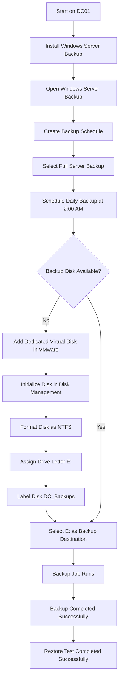
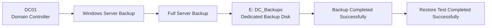
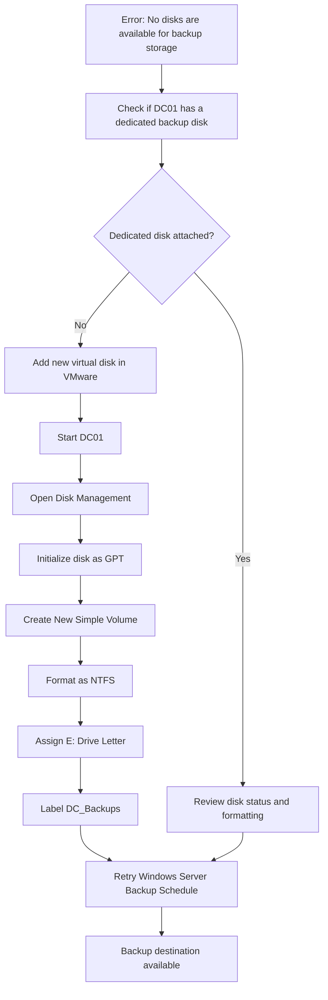
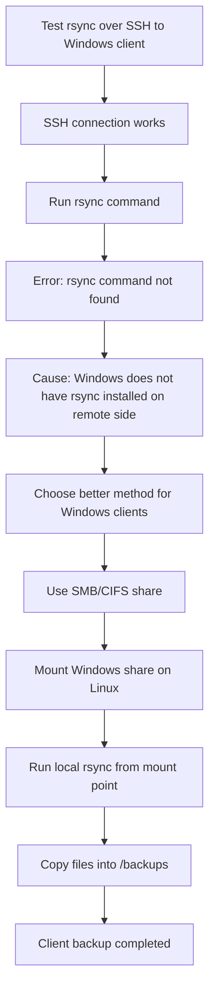
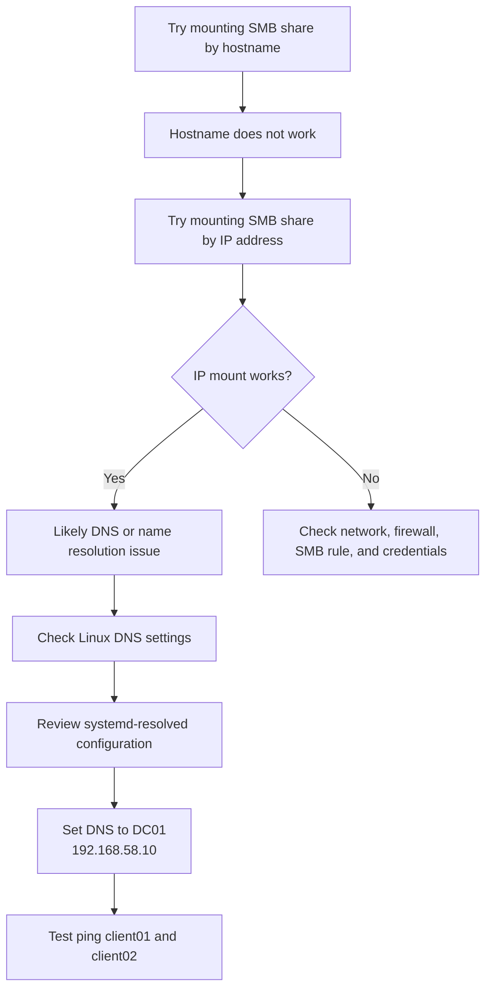
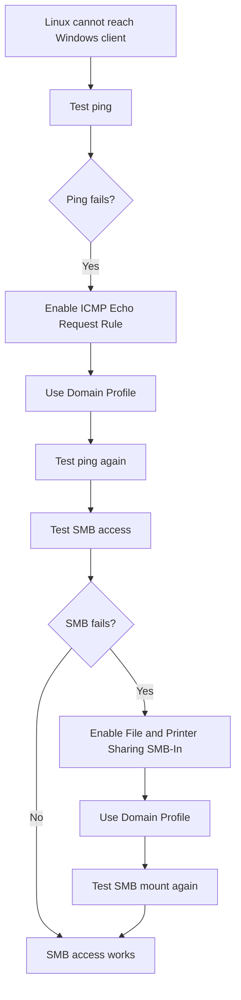
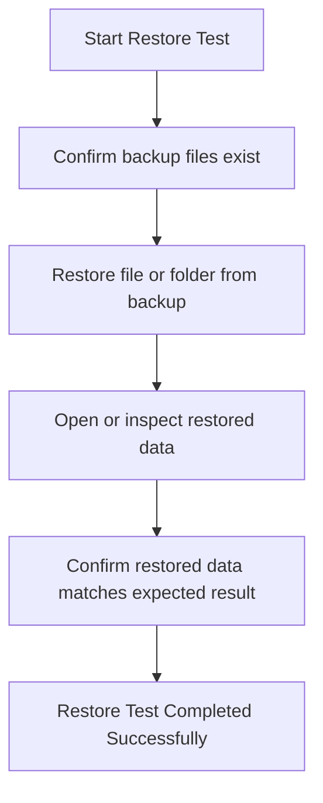

# Backup Lab Diagrams

## Overview

This document contains all diagrams for the Backup and Recovery Lab.

These diagrams show:

- DC01 backup using Windows Server Backup
- Windows client backups using SMB shares mounted on Linux
- rsync backup flow
- Cron backup schedule
- Troubleshooting flows
- Restore testing flow

Sensitive information such as passwords, tokens, private keys, recovery keys, and real credentials are not included.

## Backup Lab Topology

```mermaid
flowchart TD
    DC01[DC01<br>Windows Server 2022<br>Domain Controller] --> WSB[Windows Server Backup]
    WSB --> EDRIVE[E: Drive<br>DC_Backups<br>Dedicated Backup Disk]

    CLIENT01[Client01<br>Windows Client] --> SMB1[SMB Share<br>C:\Users]
    CLIENT02[Client02<br>Windows Client] --> SMB2[SMB Share<br>C:\Users]

    LINUX01[LINUX01<br>Linux Backup Server]

    SMB1 --> MNT1[/mnt/client01<br>Mounted on LINUX01]
    SMB2 --> MNT2[/mnt/client02<br>Mounted on LINUX01]

    LINUX01 --> MNT1
    LINUX01 --> MNT2

    MNT1 --> RSYNC1[rsync Backup Job]
    MNT2 --> RSYNC2[rsync Backup Job]

    RSYNC1 --> BACKUP1[/backups/client01]
    RSYNC2 --> BACKUP2[/backups/client02]
```

## Windows Server Backup Flow



## DC01 Backup Design



## Linux Client Backup Flow

```mermaid
flowchart TD
    START[Start on LINUX01] --> FOLDERS[Create Backup Folders]
    FOLDERS --> CLIENT01DIR[/backups/client01]
    FOLDERS --> CLIENT02DIR[/backups/client02]

    START --> MOUNTS[Create Mount Points]
    MOUNTS --> MNT1[/mnt/client01]
    MOUNTS --> MNT2[/mnt/client02]

    CLIENT01[Client01<br>Windows Client] --> SHARE1[Share C:\Users over SMB]
    CLIENT02[Client02<br>Windows Client] --> SHARE2[Share C:\Users over SMB]

    SHARE1 --> MNT1
    SHARE2 --> MNT2

    MNT1 --> RSYNC1[rsync Copy]
    MNT2 --> RSYNC2[rsync Copy]

    RSYNC1 --> CLIENT01DIR
    RSYNC2 --> CLIENT02DIR

    CLIENT01DIR --> VERIFY1[Verify Files Exist]
    CLIENT02DIR --> VERIFY2[Verify Files Exist]

    VERIFY1 --> RESTORE[Restore Test]
    VERIFY2 --> RESTORE
    RESTORE --> SUCCESS[Restore Completed Successfully]
```

## Client Backup Design

```mermaid
flowchart LR
    CLIENT01[Client01<br>C:\Users] --> SMB1[SMB Share]
    SMB1 --> MNT1[/mnt/client01]
    MNT1 --> RSYNC1[rsync]
    RSYNC1 --> B1[/backups/client01]

    CLIENT02[Client02<br>C:\Users] --> SMB2[SMB Share]
    SMB2 --> MNT2[/mnt/client02]
    MNT2 --> RSYNC2[rsync]
    RSYNC2 --> B2[/backups/client02]
```

## Final Client Backup Method

```mermaid
flowchart LR
    A[Windows Client SMB Share] --> B[Mounted on Linux]
    B --> C[Copied with rsync]
    C --> D[/backups Directory]
```

## Backup Schedule Diagram

```mermaid
timeline
    title Backup Schedule

    2:00 AM : DC01 Windows Server Backup
            : Client01 rsync backup

    2:15 AM : Client02 rsync backup
```

## Backup Folder Structure

```text
SysAdmin-HomeLab/
└── Backups/
    ├── README.md
    ├── Configs/
    ├── Commands/
    ├── Diagrams/
    └── Writeups/
```

## Linux Backup Folder Structure

```text
/backups
├── client01
└── client02
```

## Linux Mount Point Structure

```text
/mnt
├── client01
└── client02
```

## Troubleshooting Flow: Windows Server Backup Disk Error



## Troubleshooting Flow: rsync Over SSH Failed



## Troubleshooting Flow: Hostname Failed but IP Worked



## Troubleshooting Flow: Firewall Blocking Backup Access



## Restore Testing Flow



## Final Summary Diagram

```mermaid
flowchart TD
    DC01[DC01] --> WSB[Windows Server Backup]
    WSB --> DCBACKUP[E: DC_Backups]

    CLIENT01[Client01] --> SMBCLIENT01[SMB Users Share]
    CLIENT02[Client02] --> SMBCLIENT02[SMB Users Share]

    SMBCLIENT01 --> LINUXMNT1[/mnt/client01]
    SMBCLIENT02 --> LINUXMNT2[/mnt/client02]

    LINUXMNT1 --> RSYNC1[rsync]
    LINUXMNT2 --> RSYNC2[rsync]

    RSYNC1 --> BACKUPCLIENT01[/backups/client01]
    RSYNC2 --> BACKUPCLIENT02[/backups/client02]

    DCBACKUP --> RESTORE[Restore Testing]
    BACKUPCLIENT01 --> RESTORE
    BACKUPCLIENT02 --> RESTORE

    RESTORE --> DONE[Backup and Restore Workflow Verified]
```
