# File Server Lab Diagrams

## Overview

This document contains diagrams for the File Server and SMB/CIFS Lab.

The diagrams show:

- Overall file server lab topology
- Department share design
- Permission model
- Group Policy drive mapping
- SMB/CIFS media share connection to Jellyfin
- Access-Based Enumeration behavior

These diagrams are written in Mermaid so they can render directly in GitHub.

---

## Lab Topology

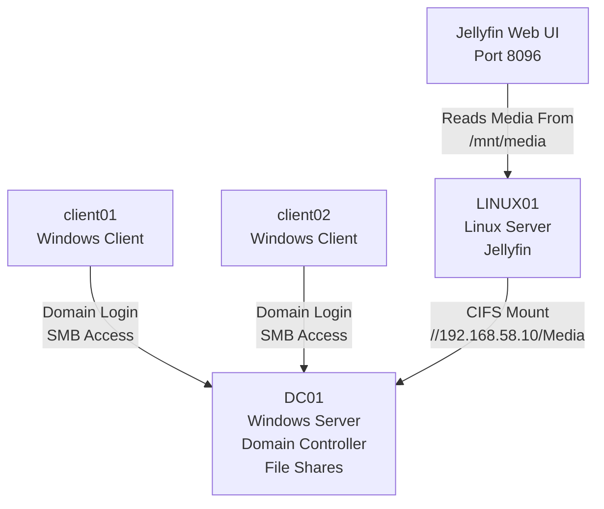

---

## File Share Structure on DC01

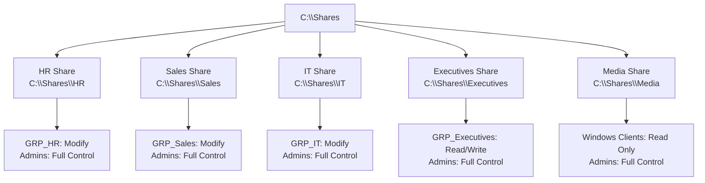

---

## Department Access Model

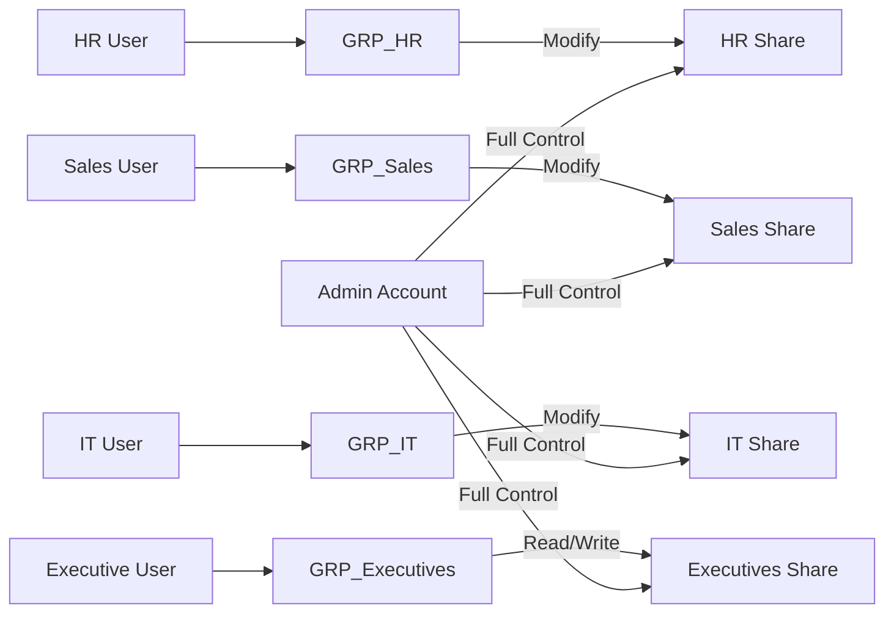

---

## Permission Flow

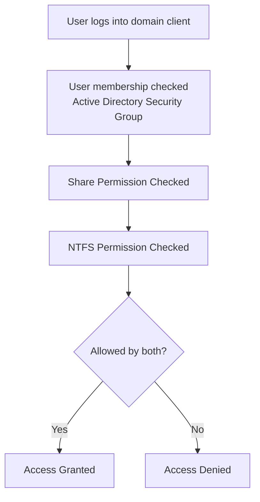

---

## Most Restrictive Permission Rule

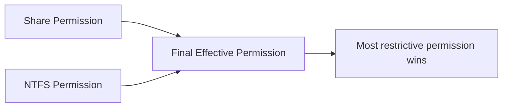

---

## Access-Based Enumeration

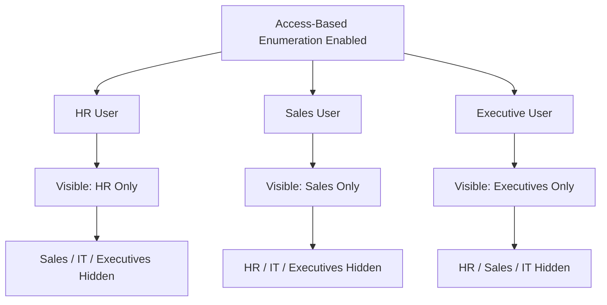

---

## Group Policy Drive Mapping

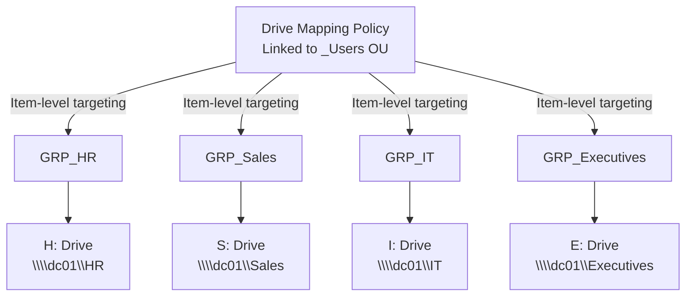

---

## Client Access Testing

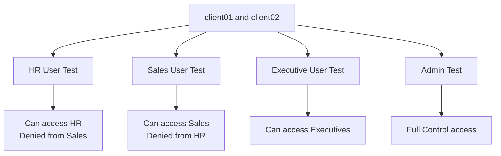

---

## Media Share and Jellyfin Flow

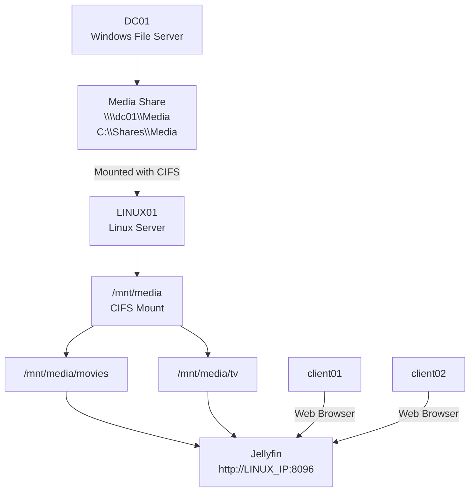

---

## Media Share Permission Design

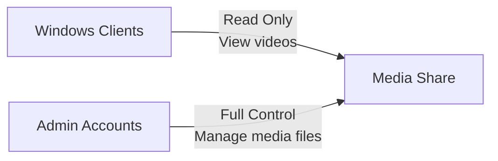

---

## Production Design Comparison

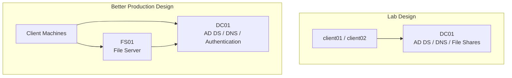

---

## Diagram Summary

| Diagram | Purpose |
|---|---|
| Lab Topology | Shows how DC01, Windows clients, LINUX01, and Jellyfin connect |
| File Share Structure | Shows the folders and shares created on DC01 |
| Department Access Model | Shows how users, groups, and shares connect |
| Permission Flow | Shows how share and NTFS permissions are checked |
| Most Restrictive Permission Rule | Shows that the most restrictive permission wins |
| Access-Based Enumeration | Shows how users only see allowed shares |
| Group Policy Drive Mapping | Shows mapped drives based on security groups |
| Client Access Testing | Shows permission testing from client machines |
| Media Share and Jellyfin Flow | Shows how Jellyfin reads media from the SMB/CIFS mount |
| Media Share Permission Design | Shows read-only client access and admin Full Control |
| Production Design Comparison | Shows why a separate file server is better in production |

---

## Notes

- These diagrams are written in Mermaid format.
- GitHub can render Mermaid diagrams directly inside Markdown files.
- The lab used `DC01` as the file server for simplicity.
- In production, file shares should usually be hosted on a separate file server such as `FS01`.
- No passwords or secrets are included in these diagrams.
