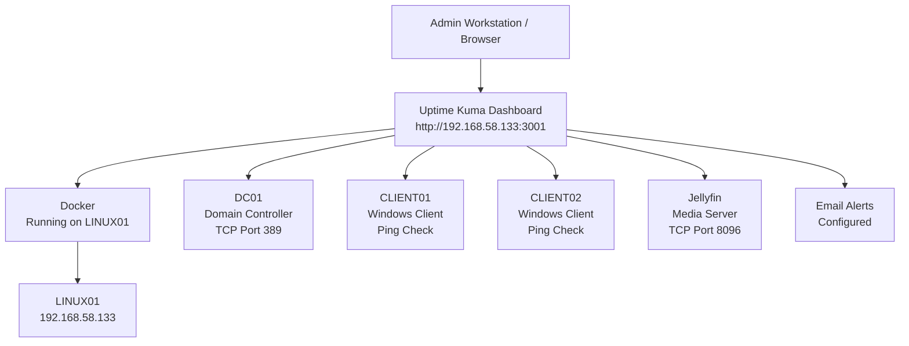
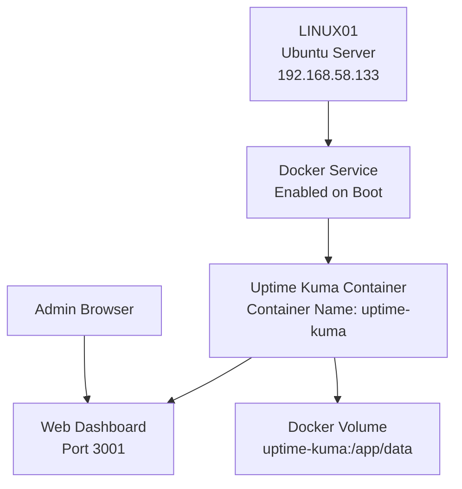
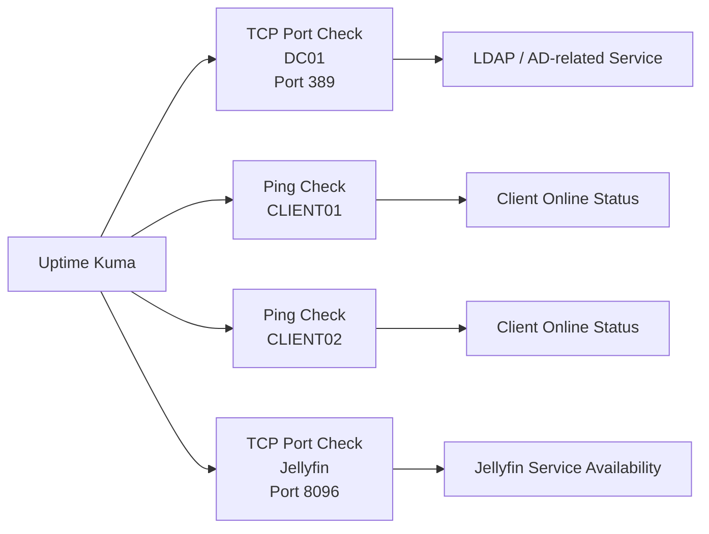
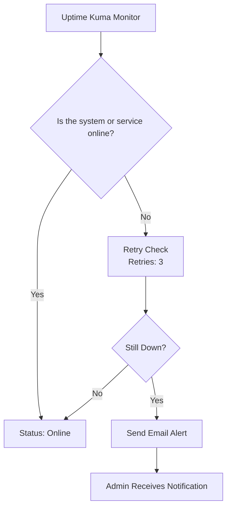
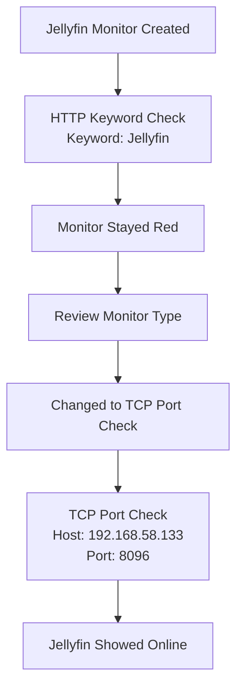
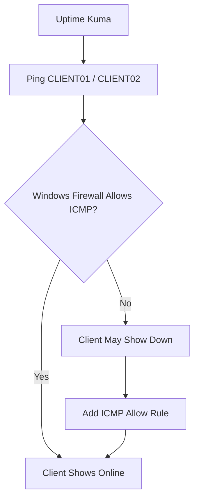
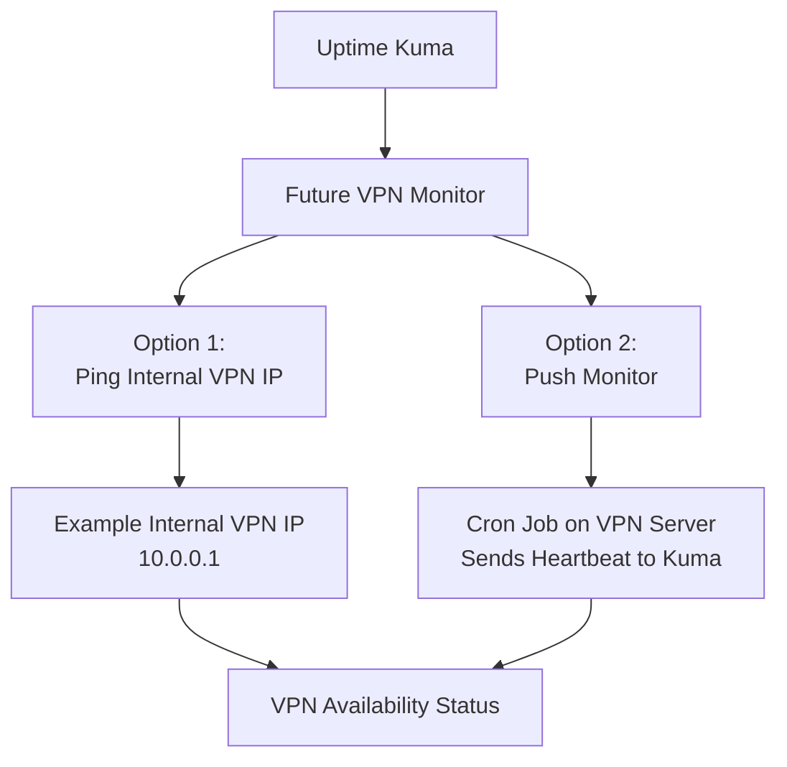

# Monitoring Lab Diagrams

## Overview

This folder contains diagrams for the Monitoring lab in my SysAdmin-HomeLab project.

The purpose of these diagrams is to show how **Uptime Kuma** was deployed and how it monitored key systems in the lab.

This monitoring lab used:

- Uptime Kuma
- Docker
- LINUX01 as the monitoring server
- DC01, CLIENT01, CLIENT02, and Jellyfin as monitored systems
- Email alerts for outage notifications

> Security note: Do not include passwords, SMTP credentials, tokens, or private notification URLs in diagrams.

---

## Diagram 1: Monitoring Lab Topology

This diagram shows the main monitoring layout.



---

## Diagram 2: Monitoring Server Design

This diagram shows how Uptime Kuma was hosted on LINUX01 using Docker.



---

## Diagram 3: Uptime Kuma Monitor Types

This diagram shows the types of checks used for each monitored system.



---

## Diagram 4: Alert Flow

This diagram shows the basic alerting flow used in the lab.



---

## Diagram 5: Jellyfin Monitoring Troubleshooting

This diagram shows the troubleshooting path for the Jellyfin monitor.



---

## Diagram 6: Windows Client Ping Monitoring

This diagram shows why Windows Firewall may affect ping monitoring.



---

## Diagram 7: Future VPN Monitoring Idea

VPN monitoring was not completed in this project. This diagram shows a possible future design.



---

## Diagram Notes

### What Was Actually Built

The following monitoring setup was completed:

- Uptime Kuma was deployed in Docker.
- Docker ran on LINUX01.
- Uptime Kuma dashboard was accessed on port `3001`.
- DC01 was monitored using TCP port `389`.
- CLIENT01 was monitored using ping.
- CLIENT02 was monitored using ping.
- Jellyfin was monitored using TCP port `8096`.
- Email alerts were configured.

### What Was Not Completed

The following items were not completed in this lab:

- VPN monitoring
- CPU monitoring
- RAM monitoring
- Disk usage monitoring
- Log monitoring
- Centralized logging

These can be added as future improvements.

---

## Suggested Diagram Files

If I export diagrams as images later, I can save them with these filenames:

| Diagram | Suggested Filename |
|---|---|
| Monitoring Lab Topology | `monitoring-lab-topology.png` |
| Monitoring Server Design | `uptime-kuma-docker-design.png` |
| Uptime Kuma Monitor Types | `uptime-kuma-monitor-types.png` |
| Alert Flow | `email-alert-flow.png` |
| Jellyfin Troubleshooting | `jellyfin-monitor-troubleshooting.png` |
| Windows Client Ping Monitoring | `windows-client-ping-monitoring.png` |
| Future VPN Monitoring Idea | `future-vpn-monitoring.png` |

---

## README Embed Example

To include one of these diagrams in the main Monitoring README later, use this format:

```markdown

```

Or keep the Mermaid diagram directly in the README if GitHub renders it correctly.

---

## Security Reminder

Before uploading diagrams to GitHub, make sure they do not show:

- Passwords
- Email passwords
- SMTP app passwords
- API tokens
- Private notification URLs
- Personal email addresses
- Public IP addresses
- Private keys
- Recovery codes
