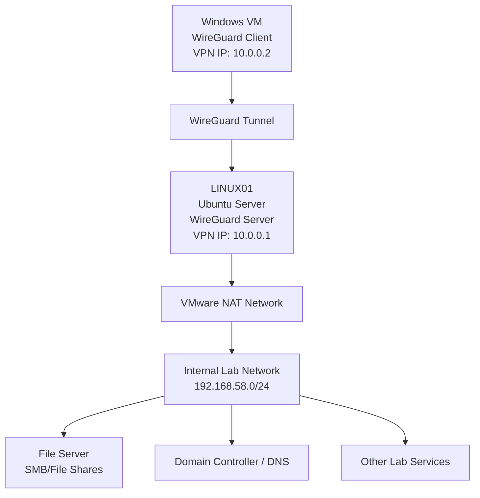
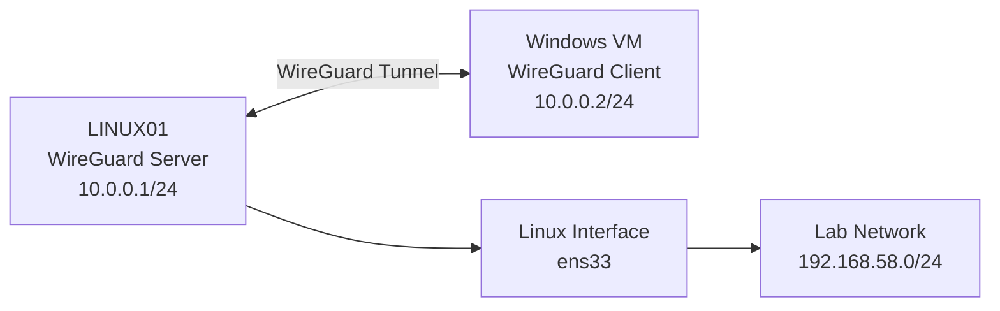
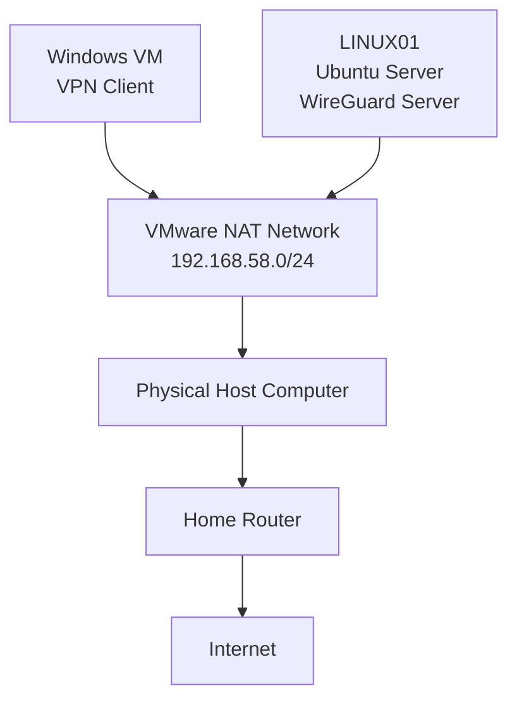
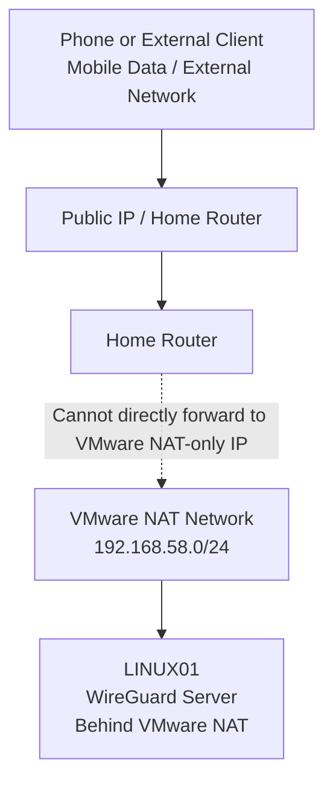
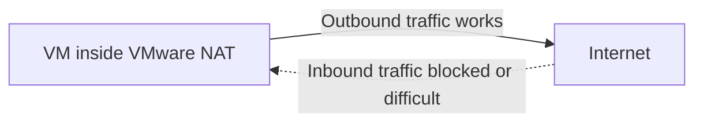
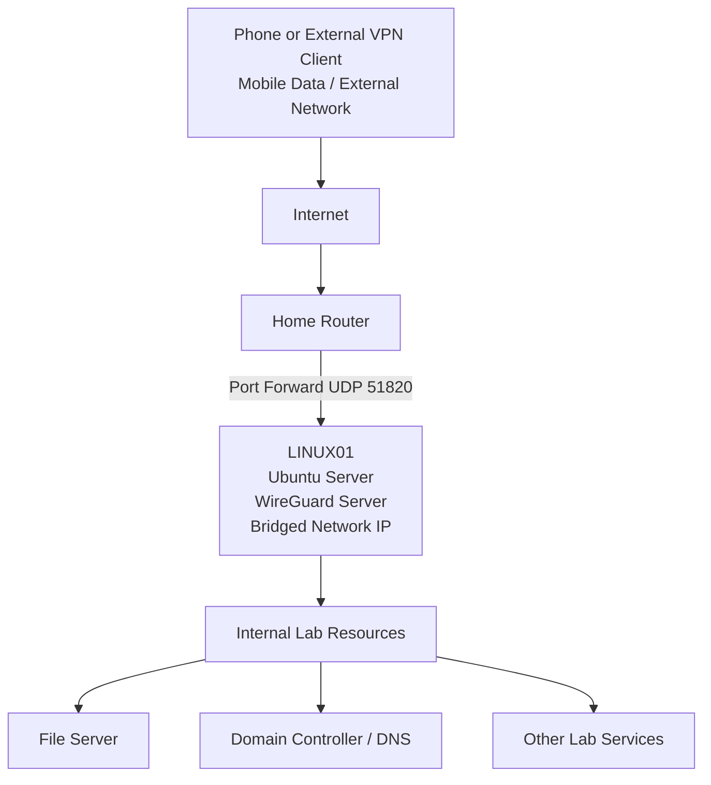
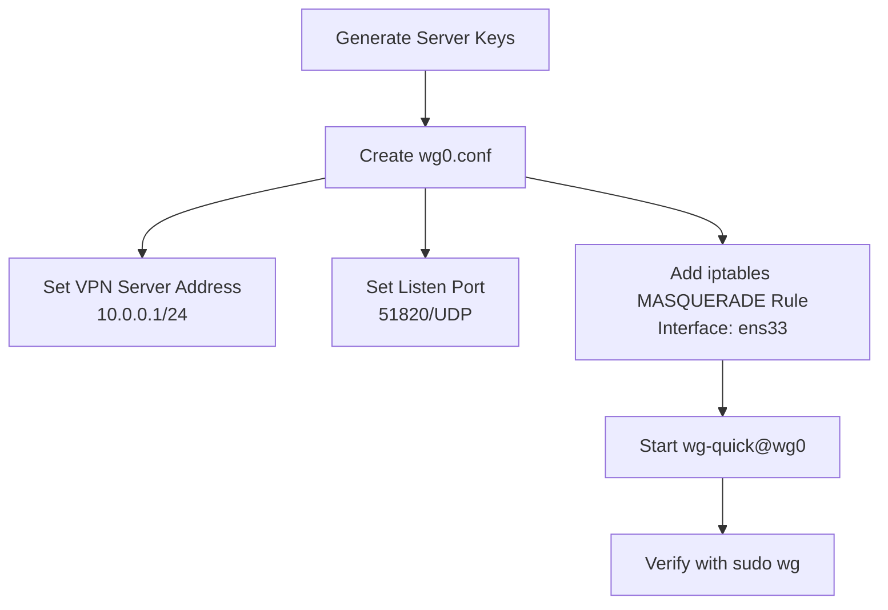
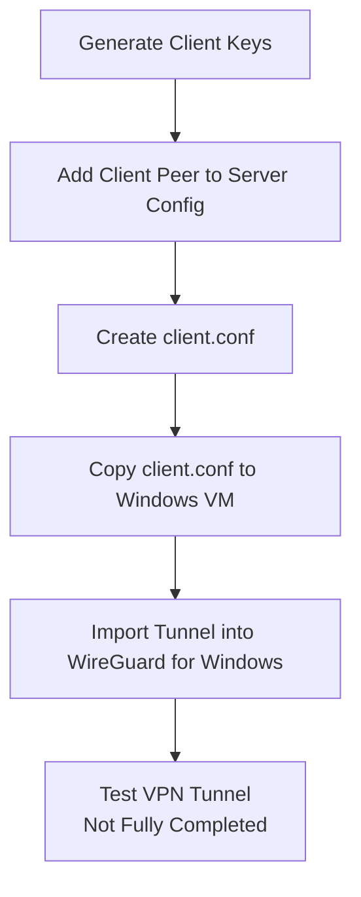
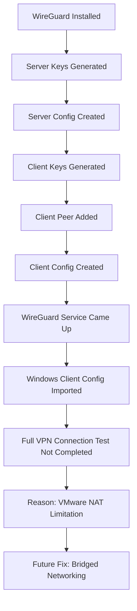
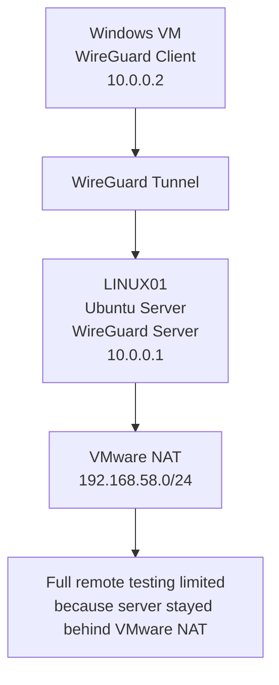

# WireGuard VPN Lab - Diagrams

## Overview

This file contains diagrams for the WireGuard VPN lab.

The VPN server was configured on `LINUX01`, an Ubuntu Server VM running inside VMware NAT. The WireGuard service came up, but full client connection and remote access testing were not completed because the server remained behind VMware NAT.

These diagrams are meant to explain:

- The intended VPN design
- The VMware NAT limitation
- Why bridged networking would be better for a future retest
- How the WireGuard server and client were planned to communicate

> Security Reminder: Do not include real public IP addresses, private keys, router login details, or sensitive home network information in diagrams uploaded to GitHub.

## Diagram 1: Lab VPN Overview



## Diagram 1 Explanation

This diagram shows the intended WireGuard VPN design.

The Windows VM was planned to act as the VPN client. `LINUX01` was configured as the WireGuard VPN server. The VPN subnet was `10.0.0.0/24`, with the server using `10.0.0.1` and the client using `10.0.0.2`.

The goal was for the VPN client to access lab resources through the WireGuard tunnel.

Examples of intended lab resources included:

- File server
- Domain controller / DNS
- Other internal lab services

Full remote access testing was not completed.

---

## Diagram 2: WireGuard VPN Addressing



## Diagram 2 Explanation

This diagram shows the basic VPN addressing used in the lab.

| Device | Role | VPN Address |
|---|---|---|
| LINUX01 | WireGuard Server | `10.0.0.1/24` |
| Windows VM | WireGuard Client | `10.0.0.2/24` |

The Linux interface used in the NAT/MASQUERADE rule was:

```text
ens33
```

The intended internal lab network was:

```text
192.168.58.0/24
```

---

## Diagram 3: VMware NAT Design Used in the Lab



## Diagram 3 Explanation

This diagram shows the VMware NAT design used in the lab.

The Linux VM and Windows VM were inside the VMware NAT network. This allowed the VMs to communicate inside the lab network and allowed outbound internet access from the VMs.

This type of setup is useful for:

- Downloading packages
- Running isolated lab networks
- Keeping VMs behind a NAT boundary
- Practicing internal server/client configurations

However, this setup made remote inbound VPN testing difficult.

---

## Diagram 4: Why External VPN Testing Failed or Was Limited



## Diagram 4 Explanation

This diagram shows why outside VPN testing was limited.

The VPN server stayed behind VMware NAT. The home router could not directly forward inbound VPN traffic to the VMware NAT-only IP address.

The issue was that the VPN server was not directly reachable from the physical network.

In simple terms:

```text
Outbound traffic from VM to internet = works
Inbound traffic from internet to VM behind VMware NAT = difficult / blocked
```

Because of this, the phone or outside client could not be fully tested against the VPN server.

---

## Diagram 5: NAT Traffic Behavior



## Diagram 5 Explanation

This diagram shows the main NAT behavior learned from the lab.

VMware NAT works well when a VM starts the connection outbound.

Examples:

- VM installs packages from the internet
- VM pings an outside server
- VM downloads updates

However, inbound connections from outside the NAT network do not automatically reach the VM.

Examples of difficult inbound connections:

- Phone trying to connect to a VPN server inside VMware NAT
- Router trying to forward UDP traffic to a VMware NAT-only IP
- External client trying to reach a lab service hosted inside VMware NAT

---

## Diagram 6: Recommended Future Bridged Design



## Diagram 6 Explanation

This diagram shows the recommended future design.

Instead of keeping the VPN server behind VMware NAT, `LINUX01` would be moved to bridged networking. That would allow the Linux VM to receive an IP address on the real home network.

With bridged networking, the router could forward UDP port `51820` directly to the VPN server.

This would make it easier to test:

- Phone connection over mobile data
- Successful WireGuard handshake
- Access to internal lab resources
- Remote access to file shares or internal services

This was not fully tested in the current project but is the recommended improvement.

---

## Diagram 7: WireGuard Server Config Flow



## Diagram 7 Explanation

This diagram shows the WireGuard server setup flow.

The main server setup steps were:

1. Generate the server keys
2. Create the `wg0.conf` file
3. Assign the server VPN IP
4. Set the WireGuard listening port
5. Add the iptables MASQUERADE rule
6. Start the WireGuard service
7. Verify status with `sudo wg`

---

## Diagram 8: WireGuard Client Config Flow



## Diagram 8 Explanation

This diagram shows the planned client configuration flow.

The main client setup steps were:

1. Generate the client keys
2. Add the client public key as a peer on the server
3. Create the client configuration file
4. Copy the client configuration to the Windows VM
5. Import the tunnel into WireGuard for Windows
6. Attempt VPN testing

The client tunnel import was completed, but full VPN connection testing was not completed.

---

## Diagram 9: File Transfer Flow for Client Config

```mermaid
flowchart LR
    ETC[/etc/wireguard/client.conf<br>Restricted Directory] --> COPY[Copy to User Home Directory]
    COPY --> HOME[/home/admin01/client.conf]
    HOME --> SCP[SCP from Windows PowerShell]
    SCP --> DESKTOP[Windows Desktop<br>client.conf]
    DESKTOP --> IMPORT[Import into WireGuard for Windows]
```

## Diagram 9 Explanation

This diagram shows how the client configuration was transferred to Windows.

The original client config was in:

```text
/etc/wireguard/client.conf
```

Because `/etc/wireguard/` is restricted, the file was copied to:

```text
/home/admin01/client.conf
```

Then SCP was used from Windows PowerShell to copy it to the Windows desktop.

Security note:

The client config contains a private key. The temporary copy should be deleted after it is transferred.

---

## Diagram 10: QR Code Setup Flow

```mermaid
flowchart TD
    CLIENTCONF[/home/admin01/client.conf] --> QRCMD[qrencode Command]
    QRCMD --> TERMINALQR[Terminal QR Code]
    QRCMD --> PNGQR[client.png QR Code Image]
    PNGQR --> PHONE[Phone WireGuard App<br>Phone Testing Not Completed]
```

## Diagram 10 Explanation

This diagram shows the QR code workflow.

A QR code was generated from the client configuration file so the profile could potentially be imported into the WireGuard mobile app.

Two methods were attempted or prepared:

```bash
qrencode -t ansiutf8 < /home/admin01/client.conf
```

```bash
qrencode -o /home/admin01/client.png < /home/admin01/client.conf
```

The QR code image was created, but phone testing was not completed.

Security note:

A WireGuard QR code contains the client configuration, including the private key. It should not be uploaded to GitHub.

---

## Diagram 11: Project Status Summary



## Diagram 11 Explanation

This diagram summarizes the project status.

Completed:

- WireGuard installed
- Server keys generated
- Client keys generated
- Server config created
- Client peer added
- Client config created
- WireGuard service came up
- Windows client config imported

Not completed:

- Full VPN client connection test
- Phone testing
- Remote access to internal services
- Bridged networking retest

Main reason:

- The VPN server remained behind VMware NAT

Recommended future fix:

- Retest using bridged networking

---

## Optional Diagram for README.md

This smaller diagram can be used directly in the main `README.md` if a shorter visual is needed.



## Final Notes

- The VPN server was `LINUX01`.
- `LINUX01` was running Ubuntu Server.
- The VPN tool was WireGuard.
- The VPN subnet was `10.0.0.0/24`.
- The server VPN IP was `10.0.0.1`.
- The client VPN IP was `10.0.0.2`.
- The Linux network interface was `ens33`.
- The network type remained VMware NAT.
- The WireGuard service came up.
- Full VPN client testing was not completed.
- Phone testing was not completed.
- Bridged networking is the recommended future improvement.
